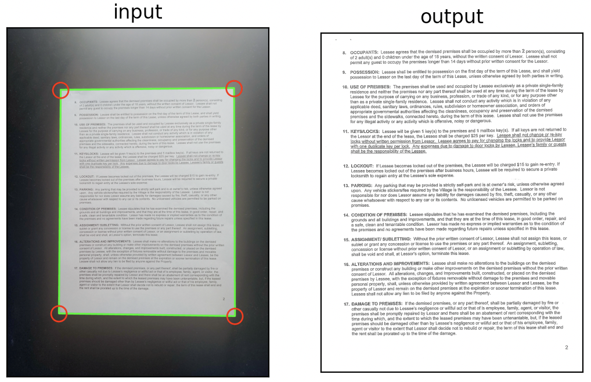

# Crop documents from photos

Design to work with US Letter paper size only (at least, for now).

Create an environment `env/` inside the repo directory using conda and the file `environment.yml`

Use python from that environment.

To test, run the following command

```
$ python docuscan.py inputfile.jpg outputfile.jpg
```

This program uses a do-it-yourself method to find the 4 edges of the document (4 different square filters that maximize pixel intensities at the 4 corresponding edges).
The 4 edges must be in the 4 corresponding quadrants of the image. The background must be dark, preferably black.

## Requirements:
* opencv
* numpy
* matplotlib
* scikit-image

The `docuscan.sh` shell script will process all files in `input/` folder and save the results in `output/` folder as image files (please create these two folders manually). On a Mac, it will also open the results in `Preview`, where you can rearrange them and then save the merged file as a pdf (print -> save as pdf).
When `docuscan.sh` is run, it deletes whatever was left in `output/` from the previous run.




# References
* https://bretahajek.com/2017/01/scanning-documents-photos-opencv/
* https://www.pyimagesearch.com/2014/09/01/build-kick-ass-mobile-document-scanner-just-5-minutes/
